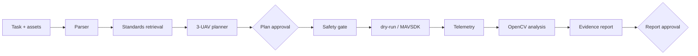

# LineGuard UAV

输电线路巡检的可审计 AI + 多无人机工程原型。系统将自然语言任务转换为三机航线，在确定性安全门控后执行 dry-run 或可选 PX4/MAVSDK 后端，再从巡检视频提取振幅、频率与角度，生成带证据的风险报告。

本项目基于 MIT 许可的 [`JoshuaC215/agent-service-toolkit`](https://github.com/JoshuaC215/agent-service-toolkit) 扩展；上游归属和本项目新增范围见 [`ATTRIBUTION.md`](ATTRIBUTION.md)。

## 新增工程能力

- **Agentic 工作流**：任务解析、规范检索、三机规划、计划审批、执行、视频分析、报告审批均进入可追踪状态机。
- **安全边界**：限高、限速、地理围栏、最小机间距与 ENU→NED 转换由确定性代码实现，LLM 输出不能直接到达飞控。
- **可恢复执行**：进程崩溃后从持久化 phase ledger 继续；使用 lease 防止双执行，并通过 outbox 幂等生成飞行与报告产物。
- **证据化分析**：OpenCV 光流 + FFT/PCA；缺少标定、置信度不足或证据缺失时返回 `needs_review`。
- **双后端**：默认 dry-run 便于本地复现；MAVSDK 后端与三实例 PX4 SITL 启动器已实现。



## 实测结果

| 验证项 | 结果 | 说明 |
| --- | ---: | --- |
| 自动化测试 | 144 passed, 2 skipped | Windows 本地全量测试 |
| 崩溃恢复 | 20/20 场景通过 | 4 个 ledger 边界，每个重复 5 次 |
| 重复副作用 | 0 | 故障恢复基准中的 flight/report artifact 重复数 |
| 静态检查 | Ruff + mypy 通过 | 65 个源文件 |

结果来自 dry-run、合成视频和本地服务链路。当前机器没有 Ubuntu/PX4/Gazebo 环境，因此仓库**不宣称**已完成真实飞行或 PX4 SITL 联调；边界详见 [`docs/VALIDATION.md`](docs/VALIDATION.md)。

## 快速开始

推荐 Python 3.11–3.13 和 [uv](https://docs.astral.sh/uv/)。

```powershell
uv sync
uv run python scripts/run_lineguard.py --uav-backend dryrun
```

打开：

- Streamlit UI: `http://localhost:8501`
- FastAPI / OpenAPI: `http://localhost:8080/docs`

没有模型 API Key 时，系统使用确定性解析器和 fake model，仍可完成 dry-run 端到端流程。OpenAI 兼容服务通过 `COMPATIBLE_MODEL`、`COMPATIBLE_API_KEY`、`COMPATIBLE_BASE_URL` 配置，变量示例见 `.env.example`。

## 测试

```powershell
uv sync --group dev
uv run pytest -q
uv run ruff format --check .
uv run ruff check .
uv run mypy src/
```

故障恢复专项：

```powershell
uv run pytest tests/lineguard/test_recovery.py tests/lineguard/test_reliability.py -q
```

## PX4 SITL（可选，尚待环境实测）

```powershell
uv sync --group uav
.\scripts\run_px4_gazebo_wsl.ps1 -Px4Dir "~/PX4-Autopilot"
```

启动器计划运行三套 `gz_x500` 实例，并让 MAVSDK Offboard 后端连接 UDP `14540–14542`。在完成真实环境测试前，请保持仿真状态说明。

## 设计文档

- [`docs/LINEGUARD_ARCHITECTURE.md`](docs/LINEGUARD_ARCHITECTURE.md)：工作流、数据流和飞控边界
- [`docs/VALIDATION.md`](docs/VALIDATION.md)：已验证项与环境限制
- [`simulation/`](simulation/)：Gazebo world 与三机仿真资源
- [`benchmarks/`](benchmarks/)：故障恢复基准结果

## License

[MIT](LICENSE)。保留上游版权声明；新增代码的归属说明见 [`ATTRIBUTION.md`](ATTRIBUTION.md)。
