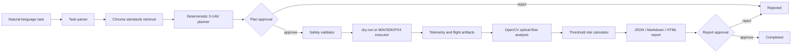

# LineGuard-UAV Agent Architecture

## Positioning

LineGuard-UAV Agent is an auditable AI and UAV simulation system for
transmission-line inspection. It
does not let an LLM invent measurements or flight parameters. The model may
parse an instruction and write narrative text, while deterministic tools own
mission geometry, video measurements, thresholds, and evidence artifacts.

The implementation is an additive extension of
[`JoshuaC215/agent-service-toolkit`](https://github.com/JoshuaC215/agent-service-toolkit)
under its MIT license. The upstream service, model registry, checkpoint support,
streaming API, and general chat UI remain available.

## Workflow



Both approval nodes use LangGraph `interrupt()`. The review API resumes the same
thread with `Command(resume=...)`. A rejection is persisted and routed to `END`.

## Data Flow

- `POST /api/assets` stores PDFs and videos under `LINEGUARD_DATA_DIR`.
- PDF pages are chunked with page and section metadata and stored in local Chroma.
- `POST /api/tasks` writes a task row and invokes the graph until plan approval.
- Approved plans pass altitude, geofence, speed, and inter-UAV separation checks.
- The default dry-run backend executes all three paths and writes deterministic
  telemetry. The MAVSDK backend converts local ENU waypoints to PX4 local NED and
  controls three SITL instances through Offboard mode.
- Completed missions select the first attached video and run optical flow inside the ROI.
- Risk calculation requires metric calibration, sufficient confidence, and a cited
  knowledge source. Otherwise the result is `needs_review`.
- Report generation stores JSON, Markdown, HTML, evidence JPEG, displacement CSV,
  and displacement PNG.
- Every node, tool, model attempt, and review receives an ordered Trace event.

## Runtime

Local smoke path:

```powershell
uv sync
uv run python scripts/run_lineguard.py
```

Open `http://localhost:8501` for the six-page Streamlit UI or
`http://localhost:8080/docs` for OpenAPI.

The default command uses the deterministic UAV backend:

```powershell
uv run python scripts/run_lineguard.py --uav-backend dryrun
```

For PX4 SITL/Gazebo in WSL:

```powershell
uv sync --group uav
.\scripts\run_px4_gazebo_wsl.ps1 -Px4Dir "~/PX4-Autopilot"
```

The launcher starts the transmission-line world, three `gz_x500` PX4 instances,
and LineGuard with `--uav-backend mavsdk`. Logs are kept under `logs/px4/`.

With an OpenAI-compatible provider:

```powershell
$env:COMPATIBLE_MODEL="your-model"
$env:COMPATIBLE_API_KEY="your-key"
$env:COMPATIBLE_BASE_URL="https://provider.example/v1"
$env:LINEGUARD_USE_LLM="true"
uv run python scripts/run_lineguard.py
```

Without an API key, the launcher enables the upstream fake model and uses the
deterministic task parser.

## Video Contract

Video calibration is supplied during upload:

```json
{
  "pixels_per_meter": 20.0,
  "roi": [50, 60, 220, 120]
}
```

The analyzer returns pixel amplitude for every successful run. Meter amplitude is
only returned when `pixels_per_meter` is present. Frequency is calculated with FFT
and ellipse angle with PCA. Low-confidence or unreadable videos never produce an
authoritative risk conclusion.

## Database

The business schema is managed by Alembic:

```powershell
uv run alembic upgrade head
```

Local default is SQLite. Docker Compose sets a PostgreSQL SQLAlchemy URL and keeps
the Chroma/assets/artifacts directory in the `lineguard_data` volume.

## UAV Boundary

- Agent and planner coordinates: local ENU.
- PX4 Offboard setpoints: local NED.
- Conversion occurs only in `lineguard.safety.enu_to_ned`.
- LLM output never reaches MAVSDK directly.
- A rejected safety check terminates the graph before arming.
- MAVSDK imports are lazy, so the normal API and dry-run tests remain usable without
  PX4 dependencies.
